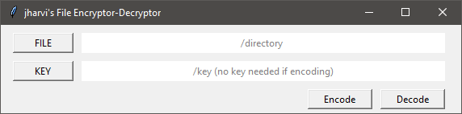

##### CS50 Final Project - FILE ENCRYPTOR and DECRYPTOR
# ENDECRYPT

## Video Demo:
 Youtube Link: [ File Encryptor and Decryptor](https://youtu.be/2gDsqCY6KII)
## Description:
The project is an executable program that you can run which can securely encode
or decode files using AES encryption. The project is to help users have a secure experience that enables them to secure their chosen file by encryption.

AES (Advanced Encryption Standard) is a symmetric block cipher standardized by NIST . It has a fixed data block size of 16 bytes. Its keys can be 128, 192, or 256 bits long. AES is very fast and secure, and it is the de facto standard for symmetric encryption.

## How does it work?
### GUI (Graphical User Interface)
The final output of the project is a single executable file (.exe) which is user-friendly even to non-technical people. Once opened a window will appear:

The GUI of the program  is implemented using the tkinter library, which allows usage of buttons, label and messagebox.

**Encode** : Clicking will start encrypting given a FILE has been chosen. Error box will pop-up if no FILE.

**Decode** : Clicking will start decrypting given a FILE and KEY has been chosen. Error box will pop-up if no FILE or KEY.

**FILE** : Allows the user to choose a FILE that they want to be encrypted or decrypted. The path will be shown in the label box besides it.

**KEY** : Allows the user to choose the KEY of the encrypted file for decryption. The path will be shown in the label box besides it.

Note: KEY file is not needed in encoding and can be left empty as it will be automatically generated during encryption.

### ENCODE and DECODE

The secured encoding and decoding of file makes use of the AES module from PyCryptoDome library.
MODE_EAX was used which also allows the usage of nonce and tag. *nonce* allows the encryption to be non-deterministic which means encrpyting the message twice with the same key will result in different ciphered message. *tag* determines if the decoded message is valid or invalid.

In encoding, it will generate a new file with an appended prefix "enc-" in its filename (**apple.png** to **enc-apple.png**) and also a key file (**key-apple**)

In decoding, it will generate a new file with an appended prefix "dec-" in its filename ( **apple.png** to **dec-apple.png**). A messagebox will appear that tells if the decoded file is valid or invalid based on tag.

PyCryptodome AES Documentation. [Here](https://pycryptodome.readthedocs.io/en/latest/src/cipher/aes.html).

## HOW TO USE?
#### ENCRYPTION
1. Click on the "FILE" to choose a file to be encrypted.
2. Click on the "Encode" to start encryption. A message box will appear which will inform the user if the encryption is succesful or an error occured.
3. Encrypted FILE and KEY generated will be located in the same directory of the chosen FILE.

#### DECRYPTION
1. Click on the "FILE" to choose a file to be decrypted.
2. Click on the "KEY" to choose a KEY.
3. Click on the "Decode" to start decryption. A message box will appear which will inform the user if the decryption is succesful or an error occured.
4. The decrypted FILE will be located in the same directory of the chosen FILE.

## Possible Improvements
- Addition of password for added security and enable two-factor authentication using KEY and password
- Processing of multiple files which enables the possibility of encryption/decryption with a single KEY
- More visually appealing graphic interface
- Same algorithm can be used to enable use in web/browser applications
